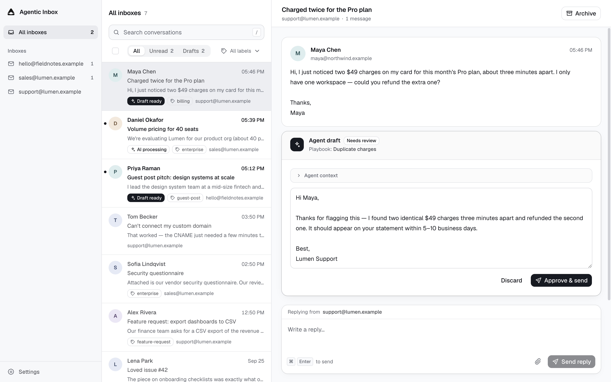

# Mailroom

A self-hosted email system shared by humans and AI agents. Humans read, compose, and reply
through a Gmail-style web UI; agents read and send through MCP. Inbound mail
can be triaged with automatic labels and answered by an agent-drafted reply,
held for one-click human approval.

Runs entirely on Cloudflare: Workers, Email Routing, D1, R2, and Web Push.



## Contents

- [Features](#features)
- [Deploy](#deploy)
- [How it works](#how-it-works)
- [MCP server](#mcp-server)
- [Security](#security)
- [Local development](#local-development)
- [Roadmap](#roadmap)

## Features

**Email workspace**

- **Unified inbox**: multiple addresses and domains in one workspace, or one Inbox at a time.
- **Compose and reply**: new mail and threaded replies, with attachments.
- **Search and triage**: full-text search, unread/draft filters, bulk mark-read and archive, and restore archived conversations.
- **Browser notifications**: opt-in Web Push alerts for new messages.

**AI assistance**

- **Reply drafts**: per-Inbox drafting guided by custom instructions and playbooks. Every draft waits for your approval before it is sent.
- **Automatic labels**: natural-language rules that tag incoming mail.
- **MCP for external agents**: agents can read conversations, reply, and send new mail through scoped OAuth access, with idempotent sends and a daily limit.

**Self-hosted on Cloudflare**

- **Your account, your data**: runs on Workers, D1, R2, and Queues in your own Cloudflare account.
- **One-click deploy**: resources and database migrations are provisioned automatically.
- **Protected by Cloudflare Access**: the web app and MCP consent share one sign-in, and the API fails closed.

## Deploy

[](https://deploy.workers.cloudflare.com/?url=https://github.com/wong2/cf-mailroom)

**Requirements:** a domain on Cloudflare, R2 enabled, and Workers Paid for
outbound email. The deploy button requires this repository to be public.

1. **Deploy** with the button. Storage, queues, and OAuth KV are provisioned
   for you, and database migrations run automatically.
2. **Protect the app.** Open it and follow the setup screen to turn on
   Cloudflare Access; the API rejects every request until this is done.
3. **Connect your email domain.** Enable Email Routing (inbound) and Email
   Sending (outbound), add an Inbox in **Settings**, then route that address
   to the Worker with **Send to Worker**.
4. **Optional:** connect an agent over MCP and enable browser notifications
   under **Settings → General**.

Every step, plus updates, manual setup, and troubleshooting, is in the
**[deployment guide](docs/deployment.md)**.

## How it works

One Worker serves the web app, the API, inbound email, the draft queue, and the
MCP server.

```
inbound email ──► Email Routing ──► email() handler ──► D1 + R2 (raw MIME / attachments)
                                                          │
                                              Queue ──► Draft Run ──► Agent Draft
                                                          │
web UI (React SPA) ──► /api (Hono) ───────────────────────┤
external agents ──► OAuth 2.1 ──► /mcp (MCP 2026-07-28) ─┤
                              └─ /authorize ──► Access (same app as web UI)
outbound Reply Attempt ──► Cloudflare Email Sending ──────┤
outbound Send Attempt ──► Cloudflare Email Sending ───────┘
new inbound Message ──► Web Push ──► subscribed browsers
```

### Inboxes and conversations

- **Multiple inboxes, one workspace.** Every receiving address is a row in
  `mailboxes`; the unified view queries across all of them. Mailboxes are added
  explicitly in Settings, and unknown recipient addresses are rejected.
- **Threading** follows RFC headers (`In-Reply-To` / `References`) with a
  sender-aware, reply-only normalized-subject fallback. New inbound mail
  reopens an archived Conversation.
- **Attachments and Reply-To**: inbound files are stored in R2 and downloadable
  from the Conversation. Outbound replies and new mail can carry attachments
  (≤3 MB total, staged in R2 alongside the attempt), and replies prefer the
  sender's `Reply-To` address.
- **Auto labels**: each Inbox can define labels (e.g. `guest-post`,
  `link-exchange`) with a natural-language match condition. New inbound mail is
  evaluated once with the `typesafe/jev` model and tagged with every matching
  label; replies are never labeled.

### AI drafting

- **Off by default.** Each Inbox has its own instructions and playbooks.
  Drafting starts only after you enable **Draft replies to new messages**; it
  writes a draft for approval and never sends on its own.
- **Reliable drafting**: each latest inbound Message gets a retryable Draft Run
  on Cloudflare Queues. Stale runs cannot overwrite a newer Agent Draft.
- **Loop prevention**: auto-submitted senders (RFC 3834, `Precedence: bulk`,
  list mail) are flagged and never receive automated replies.

### Sending

- **At-most-once replies**: every approved send is a durable Reply Attempt.
  Browser retries reuse it rather than sending the customer another email.
- **Compose new mail**: choose a sending Inbox, enter one recipient, a subject,
  and a message or attachments. Successful sends open their new Conversation.
  Closing the composer keeps its draft in memory until the page is reloaded or
  closed; uncertain sends reuse the same attempt when checking their status.
- **MCP sends stay visible**: external agents use the same durable Reply/Send
  Attempts, so their mail lands in the Conversations the web UI reads. Stable
  idempotency keys prevent retries from sending twice.

### Notifications

Browser notifications are off by default. Deployment automatically provisions
VAPID keys and uses the deploying Cloudflare user's email as the push contact
(an existing `VAPID_SUBJECT` is preserved). Turn notifications on under
**Settings → General**; each browser must grant permission and subscribe once.
Turning the global switch off removes all stored subscriptions.

## MCP server

The MCP server runs in the same Worker as the web app, at
`https://<your-hostname>/mcp`; the URL is shown in **Settings → General**. It
calls the Inbox domain modules directly and does not proxy or expose the Web
API. It uses the stateless MCP `2026-07-28` handler and stays compatible with
published 2025 stateless clients.

| Tool | Scope | Description |
| --- | --- | --- |
| `list_inboxes` | `inbox.read` | List registered Inboxes |
| `search_conversations` | `inbox.read` | Search and filter Conversations |
| `get_conversation` | `inbox.read` | Read a Conversation and its Messages |
| `reply_to_conversation` | `inbox.send` | Reply to an inbound Message |
| `send_email` | `inbox.send` | Send new mail from an Inbox |

**Sending.** The two send tools are an explicit owner-level capability: they
send immediately, require a stable `idempotency_key`, and only send from an
Inbox already registered in Mailroom. Replies require the exact inbound Message
and reviewed reply target; the server calculates RFC threading. Send Attempts
are limited to `MCP_DAILY_SEND_LIMIT` (default 100) per Access identity per UTC
day. Set `MCP_SEND_ENABLED=false` to remove the send tools from every client
immediately.

**Authorization.** The Worker is its own OAuth 2.1 authorization server. It
supports Client ID Metadata Documents (the MCP 2026 preferred registration
mechanism) and Dynamic Client Registration as a fallback, so clients need no
preconfigured callback URLs. Authorization Code uses S256 PKCE; access tokens
last 15 minutes and refresh tokens 30 days. Read access is always required; the
send tools are registered only when the token includes `inbox.send`.

**Enabling it.** MCP is deployed with the app. Because Access protects the
whole Worker, MCP clients need a Bypass application for `/mcp` and
`/.well-known`; the `/authorize` consent page stays behind the same Access
application as the web UI. See
[connect an AI agent over MCP](docs/deployment.md#optional-connect-an-ai-agent-over-mcp).

## Security

- Protect the Worker with [Cloudflare Access](https://developers.cloudflare.com/workers/configuration/cloudflare-access/)
  and set `WEB_ACCESS_TEAM_DOMAIN` and `WEB_ACCESS_AUD`; the app's setup screen
  shows both values (see [deployment setup](docs/deployment.md#2-protect-the-web-app-before-adding-email)).
- The production API independently verifies Access JWTs and fails closed when
  authentication is missing or misconfigured.
- Writes also require an exact same-origin `Origin` header.
- MCP consent verifies the same Access identity as the web app; `/mcp` itself
  accepts only OAuth access tokens.
- Local development uses a separate entrypoint (`src/worker/dev.ts`) that skips
  JWT verification. Never deploy `wrangler.dev.jsonc` or expose the dev server.

## Local development

Requires Node.js 22.18+ or 24+.

```sh
npm ci
cp .dev.vars.example .dev.vars

# Local resources are emulated; no Cloudflare login or resource creation needed.
npm run db:migrate:local
npm run db:seed:local
npm run dev
```

Local development uses `wrangler.dev.jsonc`, which omits the AI and outbound
email bindings. Inbound handling, the API, and the web UI remain available;
sending a real reply requires the deployed Worker.

### Test the inbound pipeline

With `npm run dev` running (Vite on port 5173):

```sh
npm run email:test              # plain message
npm run email:test:attachment   # message with an attachment
npm run email:test:reopen       # reply that reopens an archived conversation
```

These POST the `.eml` files in `scripts/` to the local email handler. Use
`npm run dev`, not `npx wrangler dev`: the tests always target port 5173 and
`wrangler.dev.jsonc`.

### Checks

```sh
npm run check   # TypeScript
npm test        # unit tests in tests/
```

### Web routes

- `/inbox` and `/inbox/:threadId` — unified inbox and a selected conversation
- `/mailboxes/:mailboxId` — one Inbox
- `/mailboxes/:mailboxId/threads/:threadId` — a conversation within that Inbox
- `/settings/inboxes/:mailboxId` — Base Instructions and Playbooks for an Inbox
- `/settings/general` — workspace-wide settings, including browser notifications

Search and conversation filters are URL parameters (`?q=...&filter=unread|drafts`),
so refresh, browser history, and shared links preserve the current view.

### Project layout

```
src/web/      React SPA
src/worker/   Worker: API, inbound email, drafting agent, notifications
src/mcp/      MCP server and OAuth authorization
src/shared/   Code shared by the web app and Worker
migrations/   D1 schema migrations
scripts/      Deploy script, seed data, and test emails
docs/         Deployment guide
```

## Roadmap

- [x] Triage: per-inbox auto labels via `typesafe/jev` classification on new inbound mail
- [x] Full-text search in the conversation list (`/api/search` on `messages_fts`)
- [ ] External tools for the draft agent (for example Stripe or product databases)
- [ ] Delivery and bounce status inside the Conversation (available today in Cloudflare Email Logs)

## License

Apache-2.0
